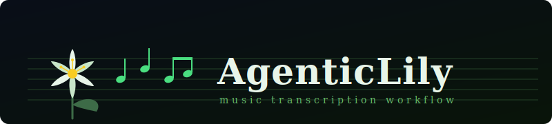

# AgenticLily



A music transcription workflow combining Claude AI with [LilyPond](https://lilypond.org/) to produce professional guitar sheet music from chord analysis conversations.

## Foreword

Let's remember that music is a language, and language should be used for a human to express intent and emotion to other living things. This tool, according to it's nature as a large language model (LLM), excels as shorthand to engrave musical ideas, or practice passages from natural language dictated by a composer. Do not use this to generate AI slop trained off stolen and scraped music; because thats what all contemporary GenAI is- theft, grifting, and false marketing. If you don't know the difference then don't use the tool.

Now, everything else below was written by a clanker:

## What It Does

AgenticLily supports two workflows: transcribing existing music, and notating original compositions from a description.

### Transcription

Chord shapes are entered as tab strings, rhythms are dictated in shorthand notation, and Claude produces a combined staff + tablature PDF.

1. **Tab input** — chord shapes entered as compact 6-character strings
2. **Chord identification** — Claude names voicings and analyses harmonic function
3. **Rhythm notation** — durations specified in shorthand (see [Notation Conventions](#notation-conventions))
4. **Sheet music generation** — LilyPond source compiled to a staff + tablature score

Example session (excerpt from *夜隠染* by MyGO!!!!!):

```
User:   244322(ee)e rq. xxxxxx(ses)
Claude: Gbmaj — beamed eighths, then rq., then dead strum. Writing bar 56.
```

### Composition

Describe what you want in plain language. Claude generates the LilyPond source and compiles it.

Example session (excerpt from *Cycle of Fifths* by nopshred):

```
User:   Generate a diatonic cycle of fifths starting from Am in A harmonic minor.
        Voice the full chord, followed by 4 descending scale tones, in 4/4.
Claude: [writes 8-bar passage — Am Dm G#dim Caug Fmaj Bdim Emaj Am,
         each chord voiced on guitar with a dotted-eighth run to the next]
```

## Repository Structure

```
AgenticLily/
├── CLAUDE.md           ← workflow instructions for the Claude agent
├── README.md           ← this file
└── ArtistName/
    └── songname/
        ├── songname.ly     ← LilyPond source
        ├── songname.pdf    ← compiled sheet music
        └── notes.md        ← chord dictionary, bar structure, analysis
```

## Songs

| Song | Artist | Type | Status |
|------|--------|------|--------|
| [夜隠染 (Yokaze)](MyGO!!!!!/yokaze/) | MyGO!!!!! | Transcription | In progress |
| [Cycle of Fifths](nopshred/cycle/) | nopshred | Composition | Complete |

## Notation Conventions

### Tab Input

Chord shapes are entered as 6-character strings representing strings low E to high e:

```
35----   ← G5 power chord (E:3, A:5, others not played)
13----   ← F5 power chord
-68676   ← Ebm7
```

- `-` = string not played
- `x` = muted string
- Two-digit frets use quotes: `-8"10"---`

### Rhythm Notation

| Symbol | Duration |
|--------|----------|
| `w` | whole note |
| `h` | half note |
| `q` | quarter note |
| `e` | eighth note |
| `s` | sixteenth note |
| `.` | dotted (×1.5) |
| `~` | tie |
| `()` | beam group |

Example: `q (e.s) (sse) (ess)` = one bar in 4/4

Groups can span chord changes — e.g. `(sse)` split as first `s` to the first chord and `se` to the second.

## Requirements

- [LilyPond](https://lilypond.org/download.html) for compiling `.ly` files to PDF
- Claude (via [Claude Code](https://claude.ai/code)) for the transcription workflow

## Compiling a Score

```bash
cd ArtistName/songname
lilypond songname.ly
```

Output: `songname.pdf`

## TODO

Script the initial transcription to ly file before using AI to fine tune. This should save some tokens and make it less expensive to use.

Use a more robust engraver (e.g., MuseScore, GuitarPro) for MIDI generation functionality.

Orchestrate a DAW (e.g., REAPER)
